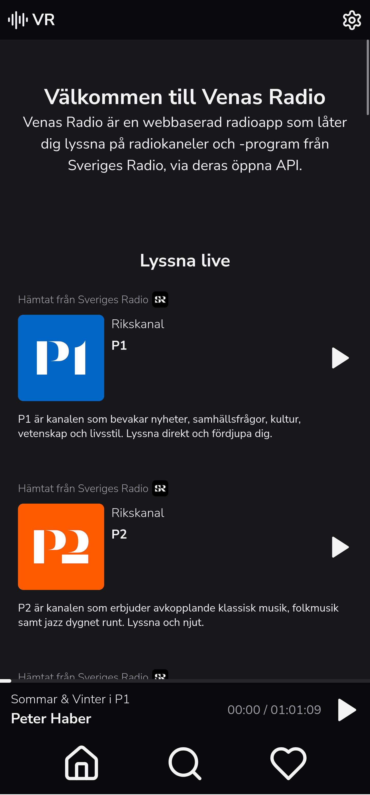
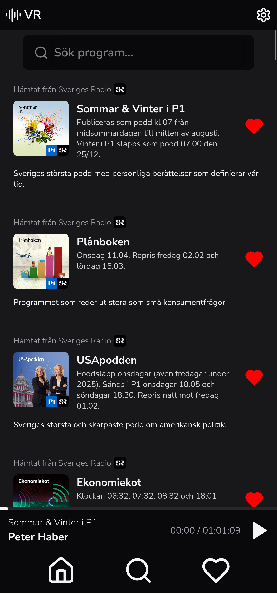
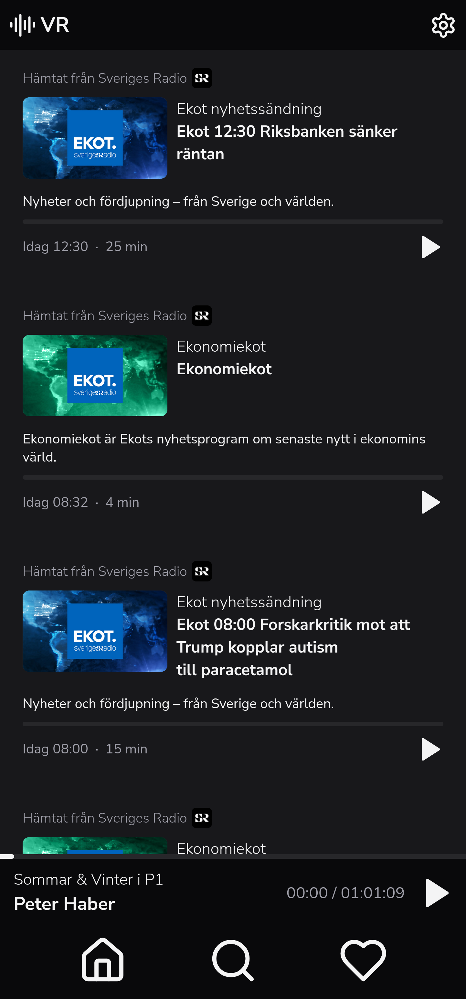

# Viggo's Radio

Visit the site [vr-radio.tailad6f63.ts.net](https://vr-radio.tailad6f63.ts.net/)

  
  
  

## Why
I was growing tired of the SR Play app on android since it had a bunch of bugs that really bugged me, so I decided to make my own version. The Swedish National Radio has a completely open API which allowed me to make this app. This is a remake and improvement of [SR-Play-For-Me](https://github.com/viggoStrom/SR-Play-For-Me).

## Stack
- Next.js
- React
- TailwindCSS
- TypeScript
- Web API

### Dev Ops and Hosting
- Tailscale
- Proxmox
  - Debian 12 VM
- GitHub
